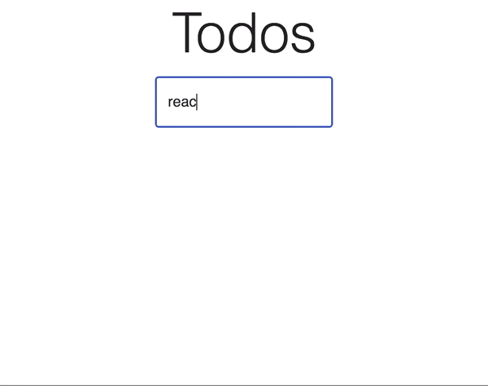
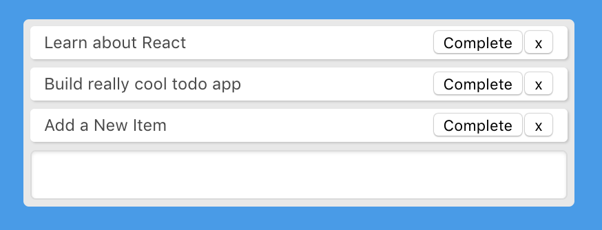
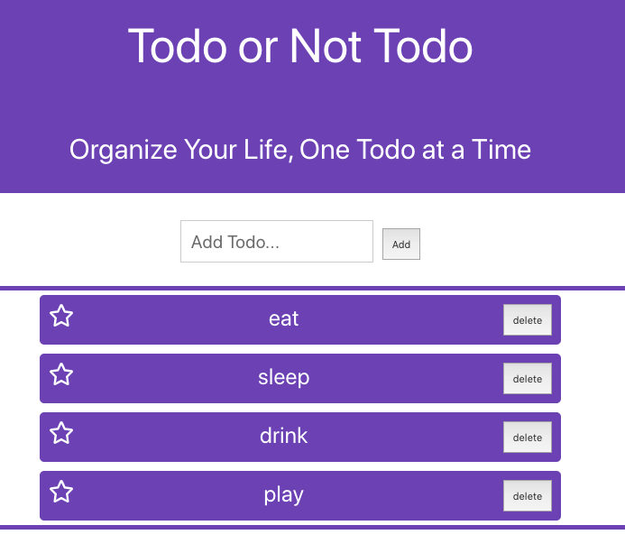
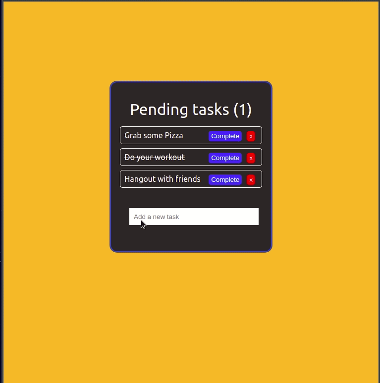
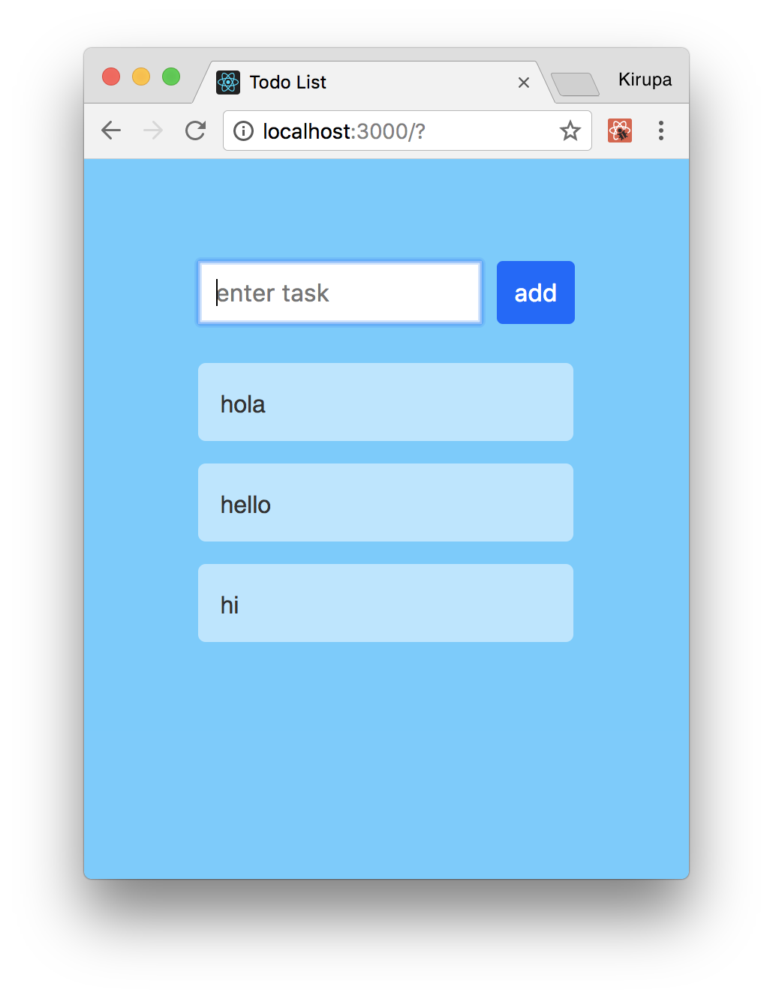

# React-todo
Task : Create a todo web app, written in react

You will be learning how to create a react app from scratch.  To kick off your research head to the following URL : https://create-react-app.dev/docs/getting-started/

For this lab, you will build a TODO list app.

Core functionality required:
* -View Todo List
* -Add a todo
* -Delete a todo
* -Delete all todos
* -Mark todo as completed

Bonus functionality : 
* -App should be appropriately styled
* -Animation on deleting / adding todos
* -Incorporating a 3rd party library for functionality or styling.  (Material-ui,Reactstrap,Styled Components)

## ********************************
## Git Instructions
- [ ] Create a template copy of this repository by clicking : "Use this template"
- [ ] Name the repository the same name as the master template repository.  
- [ ] Add your TA as collaborator
- [ ] Clone YOUR repo to your local computer
- [ ] Create a new branch: git checkout -b `<firstName-lastName>`.
- [ ] Implement the project on your newly created `<firstName-lastName>` branch, committing changes regularly.
- [ ] Push commits: git push origin `<firstName-lastName>`.
## ********************************

Below are some design ideas for sample todo list apps:

https://www.digitalocean.com/community/tutorials/how-to-build-a-react-to-do-app-with-react-hooks

https://www.pusher.com/tutorials/todo-app-react-hooks

http://todo-redux.lambdaschool.me/

https://www.freecodecamp.org/news/how-to-build-a-todo-list-with-react-hooks-ebaa4e3db3b/

https://www.kirupa.com/react/simple_todo_app_react.htm#tutorialInformation

